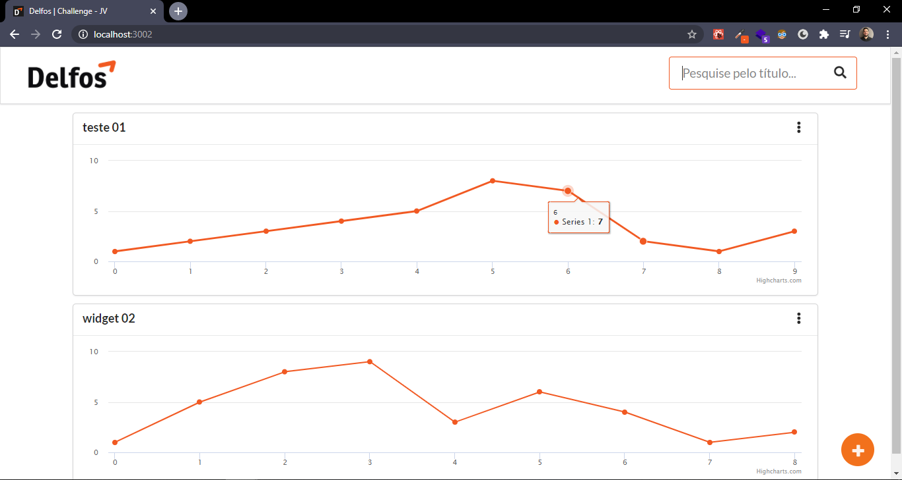
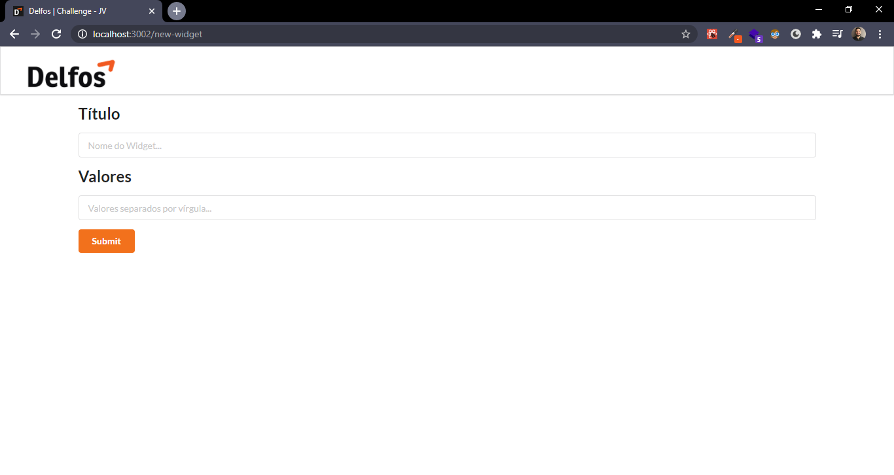

# Desafio Front-end Delfosim
> Desafio para ingressar como Front-end Developer na Delfosim em Fortaleza-CE.<br>
Brevemente, trata-se de um dashboard de gráficos onde o usuário pode listar, criar, editar, deletar os gráficos (highcharts).
Você pode encontrar uma pequena demonstração em vídeo dentro do arquivo [delfosim.zip](.github).

## Construído com:

- react (^16.13.1)
- yarn (1.22.4)
- react-router-dom (^5.2.0)
- semantic-ui-css (^2.4.1)
- semantic-ui-react (^1.2.0)
- eslint (6.8.0)
- prettier (^2.0.5)
- axios (^0.19.2)
- highcharts (^8.1.2)
- json-server (^0.16.1)
- etc...

## Como instalar e rodar localmente :computer:</strong>:

<strong>1. Clonar o projeto e instalar as dependências:</strong>

```
$ git clone -b joao-victor https://github.com/jvictor-am/frontend-test-01.git
$ cd frontend-test-01
$ cd backend && yarn install
$ cd ..
$ cd frontend && yarn install
```

<strong>2. Rodar localmente:</strong>
<br>
 - Abrir dois terminais nas pastas backend e frontend (1 para subir "backend/servidor" json-server e 1 para rodar frontend).
 - Em cada um dos terminais, digitar:
 
```
$ yarn start
```

## :framed_picture: :computer: Imagens

<h3 align="center">
  



</h3>

<br>

---

[<p align="center">**João Victor**</p>](https://www.linkedin.com/in/jo%C3%A3o-victor-de-andrade-mesquita-848a09122/)

<h2 align="center">
  Thank You!
</h2>
